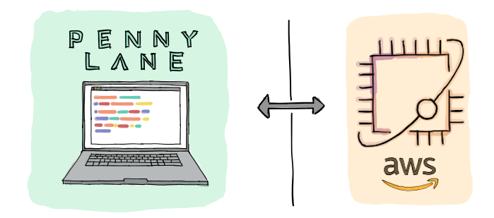

PennyLane-Braket Plugin
#######################

:Release: |release|

|

.. include:: ../README.rst
  :start-after:	header-start-inclusion-marker-do-not-remove
  :end-before: header-end-inclusion-marker-do-not-remove

Once the Pennylane-Braket plugin is installed, the provided Braket devices can be accessed straight
away in PennyLane, without the need to import any additional packages.

Devices
~~~~~~~

This plugin provides two Braket devices for use with PennyLane:

.. devicegalleryitem::
    :name: 'braket.aws.qubit'
    :description: Runs circuits on the remote Amazon Braket service.
    :link: devices/braket_remote.html

.. devicegalleryitem::
    :name: 'braket.local.qubit'
    :description: Runs circuits on the Braket SDK's local simulator.
    :link: devices/braket_local.html

.. raw:: html

        

         

While the local device helps with small-scale simulations and rapid prototyping,
the remote device provides access different backends of the Amazon Braket service, such as
high performance simulators and quantum hardware.

Tutorials
~~~~~~~~~

To see the PennyLane-Braket plugin in action, you can use any of the qubit-based `demos
from the PennyLane documentation <https://pennylane.ai/qml/demonstrations.html>`_, for example
the tutorial on `qubit rotation <https://pennylane.ai/qml/demos/tutorial_qubit_rotation.html>`_,
and simply replace ``'default.qubit'`` with the ``'braket.local.qubit'`` or the ``'braket.aws.qubit'`` device:

.. code-block:: python

    dev = qml.device('braket.XXX.qubit', [...])

Tutorials that showcase the braket devices can be found `on the PennyLane <LINK_PENNYLANE!>`_
and `Amazon Braket <LINK_AWS!>`_ examples GitHub repository.

.. toctree::
   :maxdepth: 2
   :titlesonly:
   :hidden:

   installation
   support

.. toctree::
   :maxdepth: 2
   :caption: Usage
   :hidden:

   devices/braket_remote
   devices/braket_local

.. toctree::
   :maxdepth: 1
   :caption: API
   :hidden:

   code
